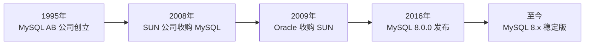

## 一、为什么要使用数据库

### 1.1 数据持久化

在软件开发中，程序运行时的数据存储在内存中，一旦程序关闭或服务器重启，数据就会丢失。**数据持久化**就是将内存中的数据存储到可靠的存储介质中，确保数据不会因为程序关闭而丢失。

| 存储方式 | 优点 | 缺点 |
|---------|------|------|
| 数据库 | 结构化存储、高效查询、支持事务、并发控制 | 需要安装数据库软件 |
| 磁盘文件 | 简单直接 | 查询效率低、无并发控制 |
| XML 文件 | 可读性好、跨平台 | 解析复杂、性能差 |
| JSON 文件 | 轻量级、易读 | 大数据量时性能差 |
| Excel | 直观易用 | 并发性差、不适合程序操作 |

### 1.2 关系型数据库

**存储方式**：数据库 → 数据表 → 数据

关系型数据库采用**关系模型**（二维表格）来组织数据，以行和列的形式存储数据，表与表之间可以建立关联关系。

| 数据库 | 默认端口 | 特点 | 适用场景 |
|--------|---------|------|---------|
| **MySQL** | 3306 | 开源免费、性能优秀、社区活跃 | Web 应用、中小型企业 |
| **Oracle** | 1521 | 功能强大、安全可靠、收费昂贵 | 银行、电信、大型企业 |
| **SQL Server** | 1433 | 微软生态、图形化管理好 | 微软平台项目 |
| **PostgreSQL** | 5432 | 开源、功能丰富、支持复杂查询 | 复杂业务、地理信息 |
| **SQLite** | - | 轻量级、嵌入式、无需安装 | 移动端、小型应用 |

### 1.3 非关系型数据库

**存储方式**：数据库 → 数据（非数据表结构）

非关系型数据库（NoSQL）不使用传统的表格关系模型，而是采用更灵活的存储方式。

| 数据库 | 存储类型 | 默认端口 | 特点 | 应用场景 |
|--------|---------|---------|------|---------|
| **Redis** | 键值对 Key-Value | 6379 | 内存数据库、高性能、支持持久化 | 缓存系统、排行榜、计数器 |
| **MongoDB** | 文档 Document | 27017 | JSON 格式、易扩展、高性能 | 大数据、内容管理、物联网 |
| **Elasticsearch** | 文档 | 9200 | 全文搜索、实时分析 | 日志分析、搜索引擎 |
| **HBase** | 列存储 Column | - | 海量数据存储、高可靠 | 大数据分析、物联网 |
| **Neo4j** | 图 Graph | 7474 | 关系存储、图查询 | 社交网络、推荐系统 |

---

## 二、MySQL 历史与特点

### 2.1 发展历史



### 2.2 MySQL 特点

| 特点 | 说明 |
|------|------|
| **开源免费** | 社区版免费使用，降低企业成本 |
| **关系型数据库** | 采用关系模型组织数据 |
| **支持千万级数据量** | 适合大中型项目 |
| **跨平台** | 支持 Windows、Linux、macOS |
| **多语言支持** | 支持 Java、Python、PHP、Node.js 等 |
| **高性能** | 查询优化器、索引机制 |
| **事务支持** | ACID 特性，数据一致性 |
| **复制与集群** | 主从复制、读写分离 |

### 2.3 MySQL 版本选择

| 版本 | 状态 | 建议 |
|------|------|------|
| MySQL 5.7 | 长期支持版（已停止维护） | 旧项目维护 |
| MySQL 8.0 | 长期支持版 | ⭐ 新项目推荐 |
| MySQL 8.1+ | 创新版 | 尝试新特性 |

---

## 三、核心概念：DB、DBMS、DBS、SQL

### 3.1 概念关系图

```
┌─────────────────────────────────────────────┐
│              DBS（数据库系统）                │
│  ┌───────────────────────────────────────┐  │
│  │           DBMS（数据库管理系统）          │  │
│  │  ┌─────────────────────────────────┐  │  │
│  │  │        DB（数据库）               │  │  │
│  │  │  ┌───────┐ ┌───────┐ ┌───────┐  │  │  │
│  │  │  │ 表1   │ │ 表2   │ │ 表3   │  │  │  │
│  │  │  └───────┘ └───────┘ └───────┘  │  │  │
│  │  └─────────────────────────────────┘  │  │
│  └───────────────────────────────────────┘  │
│                                             │
│  ┌─────────┐  ┌──────────┐  ┌────────────┐  │
│  │ DBA     │  │ 应用程序  │  │ 开发工具    │  │
│  │ 管理员   │  │ Application│ │ Developer  │  │
│  └─────────┘  └──────────┘  └────────────┘  │
└─────────────────────────────────────────────┘
         │
         │ 使用 SQL 语言操作
         ▼
   ┌───────────┐
   │   SQL     │
   │ 结构化查询 │
   │   语言     │
   └───────────┘
```

### 3.2 DB（Database，数据库）

**数据库**是存储数据的仓库，本质是一个文件系统，保存了一系列的数据。

```sql
-- 创建数据库
CREATE DATABASE IF NOT EXISTS mydb
DEFAULT CHARACTER SET utf8mb4
DEFAULT COLLATE utf8mb4_general_ci;

-- 查看所有数据库
SHOW DATABASES;

-- 使用数据库
USE mydb;

-- 删除数据库
DROP DATABASE IF EXISTS mydb;
```

### 3.3 DBMS（Database Management System，数据库管理系统）

**数据库管理系统**是操作和管理数据库的大型软件，如 MySQL、Oracle、SQL Server。

DBMS 的核心功能：

| 功能 | 说明 |
|------|------|
| 数据定义 | 定义数据库结构（DDL） |
| 数据操作 | 增删改查数据（DML） |
| 数据控制 | 权限管理、事务控制（DCL） |
| 数据查询 | 复杂查询（DQL） |
| 事务管理 | ACID、并发控制 |
| 安全管理 | 用户认证、访问控制 |
| 备份恢复 | 数据备份与恢复 |

### 3.4 DBS（Database System，数据库系统）

**数据库系统**是一个完整的体系，包含：

| 组成部分 | 说明 |
|---------|------|
| DB（数据库） | 数据的存储 |
| DBMS（数据库管理系统） | 管理软件 |
| DBA（数据库管理员） | 管理人员 |
| 应用程序 | 使用数据库的程序 |
| 硬件 | 服务器、存储设备 |

### 3.5 DBA（Database Administrator，数据库管理员）

DBA 是拥有最高权限的数据库管理员，其职责包括：

| 职责 | 具体内容 |
|------|---------|
| 数据库设计 | 定义数据库结构和存储策略 |
| 安全管理 | 定义安全性和完整性约束 |
| 性能优化 | 监控性能、重组重构数据库 |
| 备份恢复 | 制定备份策略、灾难恢复 |
| 用户管理 | 创建用户、分配权限 |

### 3.6 SQL（Structured Query Language，结构化查询语言）

SQL 是**数据库通用语言**，所有关系型数据库都支持 SQL。

| SQL 分类 | 全称 | 说明 | 核心语句 |
|---------|------|------|---------|
| **DDL** | Data Definition Language | 数据定义语言 | CREATE、ALTER、DROP |
| **DML** | Data Manipulation Language | 数据操作语言 | INSERT、UPDATE、DELETE |
| **DQL** | Data Query Language | 数据查询语言 | SELECT |
| **DCL** | Data Control Language | 数据控制语言 | GRANT、REVOKE |
| **TCL** | Transaction Control Language | 事务控制语言 | COMMIT、ROLLBACK |

```sql
-- DDL：创建表
CREATE TABLE students (
    id INT PRIMARY KEY AUTO_INCREMENT,
    name VARCHAR(50) NOT NULL,
    age INT,
    gender CHAR(1) DEFAULT '男'
);

-- DML：插入数据
INSERT INTO students (name, age, gender) VALUES ('张三', 20, '男');

-- DQL：查询数据
SELECT * FROM students WHERE age > 18;

-- DCL：授权
GRANT SELECT ON mydb.* TO 'user'@'localhost';
```

---

## 四、非关系型数据库详解

### 4.1 MongoDB（文档型数据库）

**特点**：
- 基于 NoSQL 的文档型数据库
- 数据存储为 BSON（Binary JSON）格式
- 易扩展、高性能、高可用性
- 支持丰富的查询和聚合操作

**应用场景**：大数据处理、实时分析、内容管理和交付、物联网等。

```javascript
// MongoDB 示例
// 插入文档
db.users.insertOne({
  name: "张三",
  age: 25,
  email: "zhangsan@example.com",
  hobbies: ["读书", "编程"]
});

// 查询文档
db.users.find({ age: { $gt: 20 } });
```

### 4.2 Redis（键值型数据库）

**特点**：
- 基于键值对的内存数据库
- 高性能（读写速度极快）
- 支持数据持久化
- 支持多种数据结构（字符串、哈希、列表、集合）

**应用场景**：缓存系统、实时消息推送、计数器、排行榜等高性能场景。

```bash
# Redis 示例
# 设置键值对
SET name "张三"
SET age 25

# 获取值
GET name  # "张三"

# 设置过期时间
SET token "abc123" EX 3600  # 1小时后过期
```

### 4.3 Elasticsearch（搜索引擎数据库）

**特点**：
- 基于 Lucene 的搜索引擎
- 实时分析、高可扩展
- 易于集成、支持大量插件

**应用场景**：日志和事件数据分析、全文检索、数据可视化等。

### 4.4 HBase（列式数据库）

**特点**：
- 基于 Hadoop 的列式数据库
- 适合海量数据存储
- 高可靠性、高性能

**应用场景**：大数据分析、物联网数据存储。

---

## 五、关系型数据库设计规则

### 5.1 核心概念

关系型数据库采用**关系模型**来组织数据，以行和列的形式存储数据。

```
┌─────────────────────────────────────────────┐
│              数据库 Database                  │
│  ┌─────────────────────────────────────┐    │
│  │  表1          表2          表3      │    │
│  │  ┌─────────┐ ┌─────────┐ ┌───────┐ │    │
│  │  │行/列    │ │行/列    │ │行/列  │ │    │
│  │  │         │ │         │ │       │ │    │
│  │  └─────────┘ └─────────┘ └───────┘ │    │
│  └─────────────────────────────────────┘    │
└─────────────────────────────────────────────┘
```

| 概念 | 说明 | 类比 |
|------|------|------|
| **数据库** | 表的集合 | Excel 文件 |
| **表** | 行和列组成的二维表格 | Excel 工作表 |
| **行** | 一条记录（元组） | 一行数据 |
| **列** | 数据字段（属性） | 一列数据 |
| **主键** | 唯一标识一条记录 | 身份证号 |
| **外键** | 关联其他表的主键 | 学号关联 |

### 5.2 主要产品对比

| 产品 | 特点 | 适用场景 |
|------|------|---------|
| **Oracle** | 功能强大、收费 | 银行、电信等大型项目 |
| **MySQL** | 开源免费、性能好 | Web 应用（使用最广泛） |
| **SQL Server** | 微软生态 | 微软平台项目 |
| **SQLite** | 轻量级、嵌入式 | 移动平台、小型应用 |

---

## 六、表与表的关联关系

### 6.1 一对一关联（1-1）

**实际开发中使用不多**，因为可以合并为一张表。当字段过多或需要分离敏感信息时才使用。

**设计原则**：创建唯一外键，主表的主键和从表的外键（唯一）关联。

**示例**：学生基本信息表和档案信息表

```sql
-- 主表：学生基本信息表（常用信息）
CREATE TABLE student_basic (
    no INT PRIMARY KEY,           -- 学号（主键）
    name VARCHAR(20) NOT NULL,    -- 姓名
    age INT,                      -- 年龄
    sex CHAR(1) DEFAULT '男',     -- 性别
    major VARCHAR(20),            -- 专业
    tel CHAR(11) UNIQUE NOT NULL  -- 手机号码（唯一约束）
);

-- 从表：学生档案信息表（不常用信息）
CREATE TABLE student_profile (
    no INT PRIMARY KEY,              -- 学号（主键 + 外键）
    id_card CHAR(18) UNIQUE,         -- 身份证号（唯一）
    email VARCHAR(50) UNIQUE,       -- 邮箱（唯一）
    address VARCHAR(100),            -- 家庭地址
    native_place VARCHAR(20),        -- 籍贯
    contact_person VARCHAR(20),      -- 紧急联系人
    FOREIGN KEY (no) REFERENCES student_basic(no)
);
```

**学生基本信息表设计**：

| 序号 | 字段名 | 数据类型 | 约束 | 非空 | 默认值 | 描述 |
|------|--------|---------|------|------|--------|------|
| 1 | no | INT | 主键 | 是 | | 学号 |
| 2 | name | VARCHAR(20) | | 否 | | 姓名 |
| 3 | age | INT | | 否 | | 年龄 |
| 4 | sex | CHAR(1) | | 是 | '男' | 性别 |
| 5 | major | VARCHAR(20) | | 否 | | 专业 |
| 6 | tel | CHAR(11) | 唯一 | 是 | | 手机号 |

**学生档案信息表设计**：

| 序号 | 字段名 | 数据类型 | 约束 | 非空 | 描述 |
|------|--------|---------|------|------|------|
| 1 | no | INT | 主键、外键 | 是 | 学号 |
| 2 | id_card | CHAR(18) | 唯一 | 否 | 身份证号 |
| 3 | email | VARCHAR(50) | 唯一 | 否 | 邮箱 |
| 4 | address | VARCHAR(100) | | 否 | 家庭地址 |
| 5 | native_place | VARCHAR(20) | | 否 | 籍贯 |
| 6 | contact_person | VARCHAR(20) | | 否 | 紧急联系人 |

### 6.2 一对多关联（1-n）

**最常见的关联关系**。

**示例**：班级与学生、公司与员工、商品分类与商品

**设计原则**：在从表（n 方）创建一个外键字段，指向主表（1 方）的主键。

```sql
-- 主表：班级表（1方）
CREATE TABLE classes (
    id INT PRIMARY KEY AUTO_INCREMENT,
    name VARCHAR(50) NOT NULL,    -- 班级名称
    teacher VARCHAR(20)            -- 班主任
);

-- 从表：学生表（n方）
CREATE TABLE students (
    id INT PRIMARY KEY AUTO_INCREMENT,
    name VARCHAR(20) NOT NULL,
    age INT,
    class_id INT,                  -- 外键：关联班级表
    FOREIGN KEY (class_id) REFERENCES classes(id)
);

-- 插入数据
INSERT INTO classes (name, teacher) VALUES ('计算机一班', '张老师');
INSERT INTO students (name, age, class_id) VALUES ('张三', 20, 1);
INSERT INTO students (name, age, class_id) VALUES ('李四', 21, 1);
INSERT INTO students (name, age, class_id) VALUES ('王五', 22, 1);

-- 查询：获取一班所有学生
SELECT s.name, s.age, c.name AS class_name
FROM students s
INNER JOIN classes c ON s.class_id = c.id
WHERE c.name = '计算机一班';
```

### 6.3 多对多关联（n-n）

**设计原则**：必须创建第三张表（连接表/中间表），将多对多关系拆分为两个一对多关系。

**示例**：学生与课程（一个学生可选多门课，一门课可被多个学生选）

```sql
-- 表1：学生信息表
CREATE TABLE students (
    id INT PRIMARY KEY AUTO_INCREMENT,
    name VARCHAR(20) NOT NULL,
    age INT,
    gender CHAR(1) DEFAULT '男'
);

-- 表2：课程信息表
CREATE TABLE courses (
    id INT PRIMARY KEY AUTO_INCREMENT,
    name VARCHAR(50) NOT NULL,    -- 课程名
    credit INT                    -- 学分
);

-- 表3：选课信息表（中间表/连接表）
CREATE TABLE student_courses (
    student_id INT,               -- 外键1：关联学生表
    course_id INT,                -- 外键2：关联课程表
    score DECIMAL(5,2),           -- 成绩
    PRIMARY KEY (student_id, course_id),  -- 联合主键
    FOREIGN KEY (student_id) REFERENCES students(id),
    FOREIGN KEY (course_id) REFERENCES courses(id)
);

-- 插入数据
INSERT INTO students (name, age) VALUES ('张三', 20);
INSERT INTO students (name, age) VALUES ('李四', 21);

INSERT INTO courses (name, credit) VALUES ('高等数学', 4);
INSERT INTO courses (name, credit) VALUES ('英语', 3);
INSERT INTO courses (name, credit) VALUES ('计算机基础', 2);

-- 张三选了高等数学和英语
INSERT INTO student_courses (student_id, course_id, score) VALUES (1, 1, 85.5);
INSERT INTO student_courses (student_id, course_id, score) VALUES (1, 2, 90.0);

-- 李四选了高等数学和计算机基础
INSERT INTO student_courses (student_id, course_id, score) VALUES (2, 1, 78.0);
INSERT INTO student_courses (student_id, course_id, score) VALUES (2, 3, 92.5);

-- 查询：获取张三选的所有课程
SELECT s.name AS student_name, c.name AS course_name, sc.score
FROM students s
INNER JOIN student_courses sc ON s.id = sc.student_id
INNER JOIN courses c ON sc.course_id = c.id
WHERE s.name = '张三';
```

### 6.4 自关联（Self-Reference）

**自关联**是指表中的某个字段引用本表的主键，形成自我引用关系。

**示例**：员工与上级（员工表中的 manager_id 引用本表的 id）

```sql
-- 员工表（自关联）
CREATE TABLE employees (
    id INT PRIMARY KEY AUTO_INCREMENT,
    name VARCHAR(20) NOT NULL,
    position VARCHAR(30),         -- 职位
    manager_id INT,               -- 上级ID（自引用外键）
    FOREIGN KEY (manager_id) REFERENCES employees(id)
);

-- 插入数据
INSERT INTO employees (name, position) VALUES ('王总', 'CEO');
INSERT INTO employees (name, position, manager_id) VALUES ('张经理', '技术总监', 1);
INSERT INTO employees (name, position, manager_id) VALUES ('李经理', '产品总监', 1);
INSERT INTO employees (name, position, manager_id) VALUES ('小王', '开发工程师', 2);
INSERT INTO employees (name, position, manager_id) VALUES ('小李', '测试工程师', 2);

-- 查询：获取每个员工及其上级
SELECT e.name AS employee, e.position, m.name AS manager
FROM employees e
LEFT JOIN employees m ON e.manager_id = m.id;
```

### 6.5 关联关系总结

| 关系类型 | 建表原则 | 示例 |
|---------|---------|------|
| **一对一（1-1）** | 从表创建唯一外键指向主表主键 | 学生基本信息 ↔ 学生档案 |
| **一对多（1-n）** | 从表（n方）创建外键指向主表（1方）主键 | 班级 → 学生 |
| **多对多（n-n）** | 创建中间表，包含两个外键 | 学生 ↔ 课程 |
| **自关联** | 表中外键引用本表主键 | 员工 → 上级 |

---

## 七、ORM 思想

### 7.1 什么是 ORM

**ORM（Object-Relational Mapping，对象关系映射）** 是一种编程技术，用于在面向对象编程语言中，将对象与关系型数据库中的表进行映射。

```
面向对象编程          关系型数据库
┌──────────┐       ┌──────────┐
│   类      │ ←──→ │   表      │
│  Class   │       │  Table   │
├──────────┤       ├──────────┤
│  属性     │ ←──→ │  字段     │
│ Property │       │  Column  │
├──────────┤       ├──────────┤
│  对象     │ ←──→ │  记录     │
│ Object   │       │  Row     │
└──────────┘       └──────────┘
```

### 7.2 常见 ORM 框架

| 语言 | 框架 | 说明 |
|------|------|------|
| **Java** | MyBatis / MyBatis-Plus | 半自动 ORM，灵活 |
| **Java** | Hibernate | 全自动 ORM |
| **Java** | Spring Data JPA | 基于 Hibernate 封装 |
| **Python** | SQLAlchemy | Python 最流行 ORM |
| **Python** | Django ORM | Django 内置 ORM |
| **Node.js** | Sequelize | 支持 MySQL/PostgreSQL |
| **Node.js** | TypeORM | TypeScript 优先 |
| **Node.js** | Prisma | 现代 ORM，类型安全 |

### 7.3 ORM 示例（Java MyBatis-Plus）

```java
// 实体类（对应数据库表）
@TableName("students")
public class Student {
    @TableId(type = IdType.AUTO)
    private Long id;
    
    private String name;
    private Integer age;
    private String gender;
    
    // getter/setter...
}

// Mapper 接口
public interface StudentMapper extends BaseMapper<Student> {
    // 自动继承 CRUD 方法
}

// Service 使用
@Service
public class StudentService {
    @Autowired
    private StudentMapper studentMapper;
    
    // 查询所有学生
    public List<Student> findAll() {
        return studentMapper.selectList(null);
    }
    
    // 根据ID查询
    public Student findById(Long id) {
        return studentMapper.selectById(id);
    }
    
    // 新增学生
    public void add(Student student) {
        studentMapper.insert(student);
    }
}
```

---

## 八、MySQL 数据类型速查

### 8.1 整数类型

| 类型 | 大小 | 范围（有符号） | 范围（无符号） | 说明 |
|------|------|---------------|---------------|------|
| TINYINT | 1字节 | -128~127 | 0~255 | 小整数 |
| SMALLINT | 2字节 | -32768~32767 | 0~65535 | 中小整数 |
| INT | 4字节 | -2^31~2^31-1 | 0~2^32-1 | 常用整数 |
| BIGINT | 8字节 | -2^63~2^63-1 | 0~2^64-1 | 大整数 |

### 8.2 浮点与定点类型

| 类型 | 大小 | 说明 |
|------|------|------|
| FLOAT | 4字节 | 单精度浮点数 |
| DOUBLE | 8字节 | 双精度浮点数 |
| DECIMAL(M,D) | M+2字节 | 定点数（精确值） |

```sql
-- 金额使用 DECIMAL，避免浮点精度问题
CREATE TABLE products (
    id INT PRIMARY KEY,
    name VARCHAR(50),
    price DECIMAL(10, 2)  -- 总共10位，小数2位
);
```

### 8.3 字符串类型

| 类型 | 大小 | 说明 |
|------|------|------|
| CHAR(n) | n字节 | 定长字符串 |
| VARCHAR(n) | 实际长度+1 | 变长字符串 |
| TEXT | 65535字节 | 长文本 |
| LONGTEXT | 4GB | 超长文本 |
| BLOB | 65535字节 | 二进制数据 |

### 8.4 日期时间类型

| 类型 | 大小 | 格式 | 说明 |
|------|------|------|------|
| DATE | 3字节 | YYYY-MM-DD | 日期 |
| TIME | 3字节 | HH:MM:SS | 时间 |
| DATETIME | 8字节 | YYYY-MM-DD HH:MM:SS | 日期时间 |
| TIMESTAMP | 4字节 | YYYY-MM-DD HH:MM:SS | 时间戳 |

---

## 九、数据库设计规范

### 9.1 命名规范

| 规范 | 正确示例 | 错误示例 |
|------|---------|---------|
| 表名用小写+下划线 | `user_info` | `UserInfo` |
| 字段名用小写+下划线 | `create_time` | `createTime` |
| 主键统一命名 `id` | `id` | `user_id` |
| 外键命名 `表名_id` | `class_id` | `cid` |
| 索引名 `idx_字段名` | `idx_name` | `name_index` |

### 9.2 三大范式

| 范式 | 要求 | 说明 |
|------|------|------|
| **第一范式（1NF）** | 字段不可再分 | 每个字段都是原子的 |
| **第二范式（2NF）** | 非主键字段完全依赖主键 | 消除部分依赖 |
| **第三范式（3NF）** | 非主键字段直接依赖主键 | 消除传递依赖 |

```sql
-- 违反第一范式：地址可再分
CREATE TABLE users (
    id INT PRIMARY KEY,
    name VARCHAR(20),
    address VARCHAR(100)  -- "北京市海淀区xxx路xxx号"
);

-- 符合第一范式：拆分地址
CREATE TABLE users (
    id INT PRIMARY KEY,
    name VARCHAR(20),
    province VARCHAR(20),
    city VARCHAR(20),
    street VARCHAR(50)
);
```

### 9.3 字段设计建议

| 建议 | 说明 |
|------|------|
| 能用 TINYINT 就不用 INT | 节省空间 |
| 金额用 DECIMAL | 避免精度问题 |
| 时间用 DATETIME 或 TIMESTAMP | 统一格式 |
| 字符串用 VARCHAR | 节省空间 |
| 主键用 BIGINT AUTO_INCREMENT | 避免溢出 |
| 每张表都要有主键 | 标准规范 |
| 每张表都要有 create_time、update_time | 记录维护 |

---

## 十、学习建议

### 10.1 学习路径

```
基础阶段                    进阶阶段                    高级阶段
┌──────────────┐         ┌──────────────┐         ┌──────────────┐
│ 数据库概念    │         │ 多表查询      │         │ 索引优化      │
│ SQL 基础语法  │  ──▶    │ 子查询        │  ──▶    │ 事务与锁      │
│ 单表CRUD     │         │ 聚合函数      │         │ 存储过程      │
│ 数据类型      │         │ 连接查询      │         │ 触发器        │
│ 约束与设计    │         │ 视图          │         │ 性能调优      │
└──────────────┘         └──────────────┘         └──────────────┘
```

### 10.2 推荐工具

| 工具 | 用途 | 推荐度 |
|------|------|--------|
| **Navicat** | 图形化管理 | ⭐⭐⭐⭐⭐ |
| **MySQL Workbench** | 官方工具 | ⭐⭐⭐⭐ |
| **DataGrip** | JetBrains 出品 | ⭐⭐⭐⭐⭐ |
| **DBeaver** | 免费开源 | ⭐⭐⭐⭐ |
| **phpMyAdmin** | Web 端管理 | ⭐⭐⭐ |

### 10.3 练习建议

1. **安装 MySQL**：本地安装 MySQL 8.0
2. **创建练习数据库**：设计一个电商系统的数据库
3. **练习 SQL**：每天写 10 条 SQL 语句
4. **阅读官方文档**：[MySQL 官方文档](https://dev.mysql.com/doc/)
5. **刷题练习**：LeetCode SQL 题目、牛客网 SQL 题目

---

> 💡 **小结**：本章介绍了 MySQL 数据库的基础概念，包括数据库分类、MySQL 历史与特点、核心概念（DB/DBMS/DBS/SQL）、数据库设计规则与表关联关系。掌握这些基础知识后，就可以开始学习 SQL 语法和数据库操作了。
