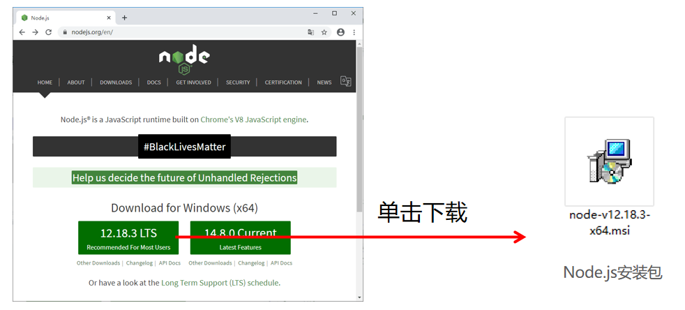
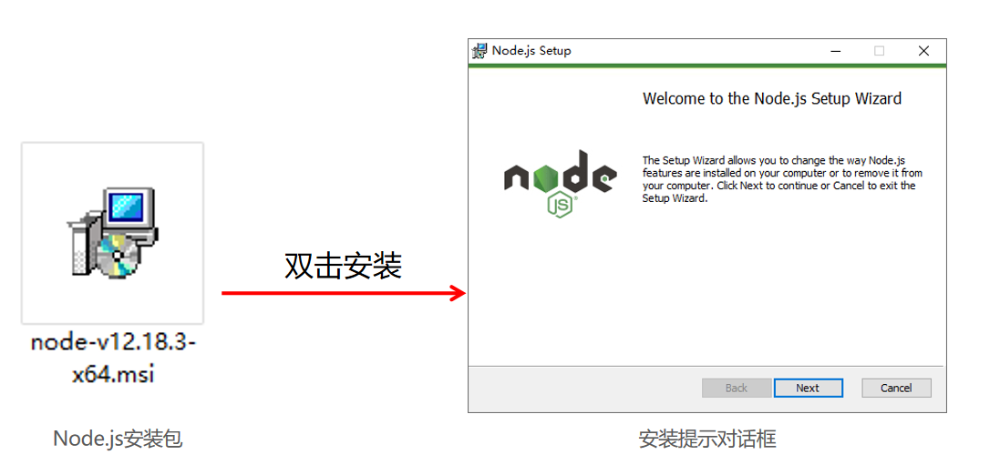
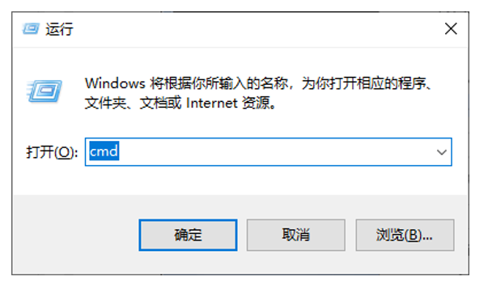
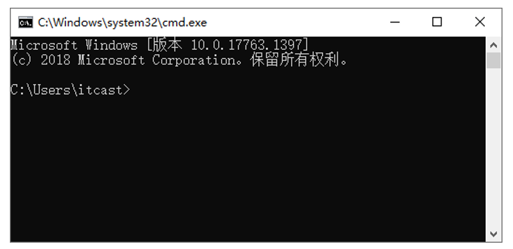
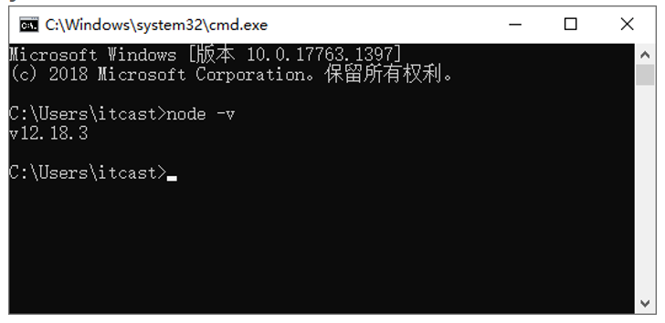
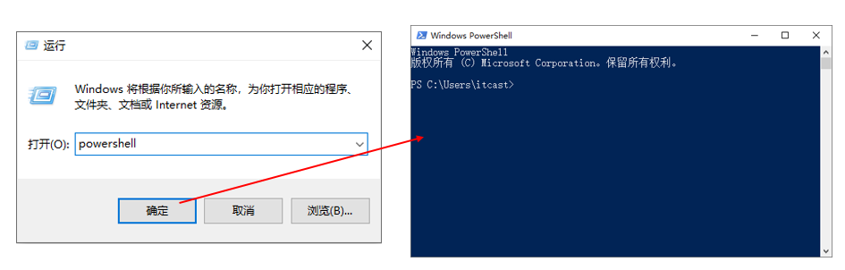
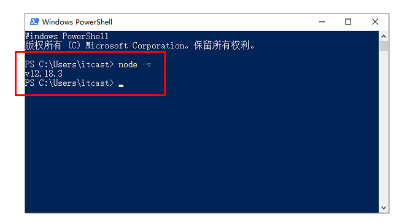

## Node.js 模块化开发

### Node.js运行环境搭建

Node.js是一个基于**Chrome V8引擎**的JavaScript代码运行**环境**，也可以说是一个运行时平台，提供了一些功能性的API，如**文件操作API**、**网络通信API**。
如果在浏览器运行JavaScript代码，浏览器就是JavaScript代码的运行环境；

> 

**如果在Node.js平台运行JavaScript代码，Node.js就是JavaScript代码的运行环境。**

#### 下载和安装

打开Node.js官方网站，找到Node.js下载地址。

官网：[https://nodejs.org/en](https://nodejs.org/en)

#### 测试Node.js是否安装成功

按**Windows+R**组合键，打开“运行”对话框，输入**cmd**。

单击**确定**按钮，或者直接按**Enter**键，会打开**cmd命令提示符界面**。

在cmd命令提示符界面中，输入命令**node -v**，按**Enter**键，显示当前安装的Node.js版本。

若想要退出cmd命令提示符界面，可以输入**exit**并按**Enter**键，或者单击cmd命令提示符界面右上角的“×”（关闭）按钮。

> 

多学一招：PowerShell工具测试Node.js是否安装成功

#### Node.js环境常见安装失败情况

不同用户使用的系统配置是不统一的，在一些系统配置中会有不稳定的配置，可能会导致Node.js环境安装失败。

错误代号2503的解决方法

在安装过程中，突然弹出了一个消息框，提示2503错误。

> 

解决方法

（1）使用管理员身份运行PowerShell命令提示符工具。

（2）以管理员身份进入PowerShell命令提示符界面。

执行命令报错

Node.js安装成功后，输入“node -v”命令进行验证Node运行环境是否安装成功时报错。

在常规情况下，Node.js安装过程中，安装包会自动把Node.js的安装目录放入到系统的环境变量Path中，若是出现上图错误表明操作失败。
**解决方法是需要手动将Node.js安装目录添加到环境变量Path中。**

> 

解决方法：以Windows 10操作系统为例

（1）首先找到Node.js的安装目录，本机的Node.js安装目录是C:\Program Files\nodejs，将该目录地址进行复制。

（2）右击“此电脑”图标，选择“属性”命令，进入“系统”界面，执行如下操作。

### Node.js的基本使用

#### Node.js的组成

JavaScript和Node.js的核心语法都是ECMAScript。

JavaScript在客户端和服务端实现不同功能

> 

客户端

JavaScript需要依赖**浏览器**提供的JavaScript引擎解析执行，浏览器还提供了对DOM的解析，所以客户端的JavaScript不仅应用了核心语法ECMAScript，而且能**操作DOM**和**BOM**，常见的应用场景如用户交互、动画特效、表单验证、发送Ajax请求等。

> 

服务器端

JavaScript不依赖浏览器，而是由**特定的运行环境**提供的JavaScript引擎解析执行，例如Node.js。服务器端的JavaScript应用了核心语法ECMAScript，但是**不操作DOM和BOM**，它常常用来做一些在客户端做不到的事情，例如操作数据库、操作文件等。另外，在客户端的Ajax操作只能发送请求，而接收请求和做出响应的操作就需要服务端的JavaScript来完成。

#### Node.js基础语法

通过node命令解析和执行一个js脚本文件的步骤如下：

- 根据node命令指定的文件名称，读取js脚本文件。

- 解析和执行JavaScript代码。

- 将执行后的结果输出到命令行中。

> 

演示在Node.js中如何执行一个js脚本文件

在chapter02目录下新建helloworld.js文件，编写JavaScript代码

console.log(&#x27;hello world&#x27;);

打开命令行工具，切换到helloworld.js文件所在的目录，并输入“node helloworld.js”命令。

#### Node.js全局对象global

在之前使用JavaScript的过程中，在浏览器中默认声明的变量、函数等都属于**全局对象window**，全局对象中的所有变量和函数在全局作用域内都是有效的。

例如，我们使用console.log()进行值的输出时，console.log()属于window对象的方法，又因为window是全局对象，所以在实际使用中可以省略掉window。

**Node.js代码的运行环境存在window对象吗?**

在Node.js代码的运行环境中没有DOM和BOM，因此也就**不存在window对象**。

**那么使用的console.log()是来自于哪里呢？**

在Node.js中，默认就是**模块化**的，默认声明的变量、函数都属于当前文件模块，都是私有的，只在当前模块作用域内可以使用。

**Node.js中是否只有模块作用域？**

答案是否定的，如果想在全局范围内为某个变量赋值，可以应用**全局对象global**。Node.js中的global对象类似于浏览器中的window对象，用于**定义全局命名空间**，所有全局变量（除了global本身以外）都是global对象的属性，在实际使用中可以省略global。

> 

演示console.log()和setTimeout()方法在Node.js运行环境中的使用

在chapter02目录下新建global.js文件，编写JavaScript代码。

global.console.log(&#x27;我是global对象中的console.log()方法&#x27;);
global.setTimeout(() =&gt; &#123;
 console.log(&#x27;123&#x27;);
&#125;, 2000);

打开命令行工具，切换到global.js文件所在的目录，并输入“node global.js”命令

### 初识模块化开发

**模块化是软件的一种开发方式**，利用**模块化**可以把一个非常复杂的系统结构细化到具体的功能点，每个功能点看作一个**模块**，然后通过某种规则把这些小的模块组合到一起，构成模块化系统。下面将详细讲解为什么使用模块化开发和模块化的概念。

#### 传统JavaScript开发的弊端

传统浏览器端JavaScript在使用的时候存在的两大问题

文件依赖

在JavaScript中文件的依赖关系是由文件的**引入先后顺序决定**的。在开发过程中，一个页面可能需要多个文件依赖，但是仅从代码上是看不出来各个文件之间的依赖关系，这种依赖关系存在**不确定性**。如果更改文件的引入先后顺序，就很有可能导致程序错误。

命名冲突

在JavaScript中，文件与文件之间是**完全开放的**，并且语法**本身不严谨**，如果在后续引入的文件中声明了一个同名变量，则后面文件的变量会覆盖前面文件中的同名变量，这样会导致程序存在潜在的**不确定性**。

#### 模块化的概念

现实生活中手机的模块化

从生产角度来看，模块化是一种生产方式，体现了以下两个特点:

- 生产效率高：灵活架构，焦点分离；多人协作互不干扰；方便模块间组合、分解。

- 维护成本低：可分单元测试；方便单个模块功能调试、升级。

软件中的模块化开发

从程序开发角度，模块化是一种开发模式，有以下两个特点:

- 生产效率高：方便代码重用，别人开发好的模块功能可以直接拿过来使用，不需要重复开发类似的功能。

- 维护成本低：软件开发周期中，由于需求经常发生变化，最长的阶段并不是开发阶段，而是维护阶段，使用模块化开发的方式更容易维护。

### 模块成员的导入和导出

#### exports和require()

在模块化开发中，**一个JavaScript文件就是一个模块**，模块内部定义的变量和函数默认情况下在外部无法得到。如何得到模块内部定义的变量和函数呢？

Node.js为开发者提供了一个简单的模块系统，**exports是模块公开的接口**，**require()**用于从外部获取一个模块的接口，即获取模块的exports对象。

如何在一个文件模块中获取其他文件模块的内容？

- 首先需要使用require()方法加载模块；

- 然后在被加载的模块中使用exports或者module.exports对象向外开放变量、函数等；require()函数的作用是加载文件并获取该文件中的module.exports对象接口。

> 

演示如何在Node.js中进行模块成员的导入和导出
在chapter02\demo01目录下，新建info.js文件作为被加载模块。

// 声明一个add()函数用来实现加法功能
const add = (n1, n2) =&gt; n1 + n2;
// exports对象向模块外开放add()函数
exports.add = add;

在demo01目录下新建b.js文件，实现在b.js模块中导入info.js模块。

// 模块导入时，模块的后缀.js可以省略
const info = require(&#x27;./info&#x27;);
// 结果为：30 	
console.log(info.add(10, 20));

打开命令行工具，切换到b.js文件所在的目录，并输入“node b.js”命令。

总结Node.js的模块化开发的步骤：

- 通过exports对象对模块内部的成员进行导出。

- 通过require()方法对依赖的模块进行导入操作。

#### module.exports

#### exports和module.exports的区别

#### ES6中的export和import

### Node.js系统模块

### Node.js第三方模块

### Node.js常用开发工具

### 在项目中使用gulp

### 项目依赖管理

### Node.js模块加载机制
