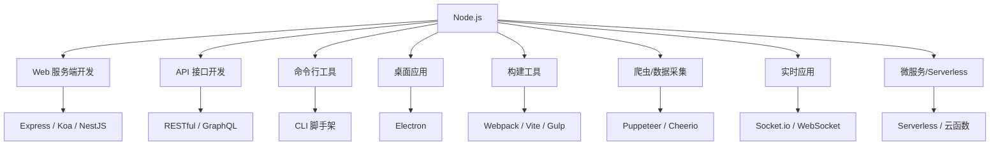

## 一、Node.js 是什么

### 1.1 一句话概括

**Node.js 是一个基于 Chrome V8 引擎的 JavaScript 运行时环境（Runtime）**，它让 JavaScript 脱离浏览器，能够在服务器端（操作系统层面）运行，成为一门可以进行服务端开发、命令行工具开发、桌面应用开发的全栈语言。

### 1.2 Node.js 的核心组成

Node.js 由三大部分组成：

| 组成部分 | 说明 | 作用 |
|---------|------|------|
| V8 引擎 | Google 开发的 JavaScript 引擎 | 解析和执行 JavaScript 代码 |
| 事件循环 (Event Loop) | 非阻塞 I/O 模型 | 实现高并发、异步处理 |
| 核心模块 | fs、http、path、os 等 | 提供文件操作、网络通信等能力 |

### 1.3 Node.js 能做什么



### 1.4 Node.js vs 浏览器 JavaScript

| 对比项 | 浏览器 JavaScript | Node.js JavaScript |
|--------|------------------|-------------------|
| 运行环境 | 浏览器 | Node.js 运行时 |
| 引擎 | V8（Chrome）/ SpiderMonkey（Firefox） | V8 |
| DOM 操作 | ✅ 可以 | ❌ 不可以 |
| BOM 操作 | ✅ 可以 | ❌ 不可以 |
| 文件操作 | ❌ 不可以 | ✅ 可以（fs 模块） |
| 网络编程 | ❌ 不可以 | ✅ 可以（http/net 模块） |
| 全局对象 | window | global / globalThis |
| 模块系统 | ES Modules | CommonJS / ES Modules |
| npm 包 | 部分支持 | 完整支持 |

## 二、知识体系路线图

### 2.1 学习路径总览

```
阶段一：基础入门        阶段二：核心能力        阶段三：Web 开发
┌─────────────┐      ┌─────────────┐      ┌─────────────┐
│ 01 环境搭建  │ ──▶  │ 03 核心模块  │ ──▶  │ 05 网络编程  │
│    & ES6     │      ├─────────────┤      ├─────────────┤
├─────────────┤      │ 04 异步编程  │      │ 06 Express  │
│ 02 模块化    │ ──▶  │  & 事件循环  │ ──▶  ├─────────────┤
└─────────────┘      └─────────────┘      │ 07 数据库    │
                                           └─────────────┘

         阶段四：项目实战
┌─────────────────────────────────────┐
│ 08 项目实战                          │
│  ├── 用户管理系统                     │
│  ├── API 接口服务                     │
│  └── 数据爬虫                         │
└─────────────────────────────────────┘
```

### 2.2 章节详情

| 序号 | 章节名称 | 核心知识点 | 学习目标 |
|------|---------|-----------|---------|
| 01 | 环境搭建与ES6基础 | Node.js安装、nvm、ES6新特性、Promise、async/await | 搭建开发环境，掌握现代JavaScript语法 |
| 02 | 模块化开发 | CommonJS、ES Modules、exports/module.exports、npm包管理 | 理解模块化原理，管理项目依赖 |
| 03 | 核心模块详解 | fs、path、os、url、process、events、stream | 熟练使用Node.js内置模块 |
| 04 | 异步编程与事件循环 | 事件循环机制、宏任务/微任务、Promise、async/await | 理解Node.js异步模型，编写高效异步代码 |
| 05 | 网络编程与Web服务 | http模块、TCP/UDP、创建Web服务器、静态文件服务 | 掌握Node.js网络编程基础 |
| 06 | Express框架实战 | 路由、中间件、请求/响应、错误处理、路由拆分 | 使用Express快速搭建Web应用 |
| 07 | 数据库操作实战 | MySQL、MongoDB、Redis、ORM（Sequelize/Mongoose） | 连接和操作主流数据库 |
| 08 | 项目实战案例 | 用户系统、API服务、爬虫项目 | 独立完成Node.js项目开发 |

## 三、学习建议

### 3.1 适合人群

- **前端开发者**：希望拓展全栈能力，进入后端领域
- **后端开发者**：希望使用 JavaScript/TypeScript 进行服务端开发
- **编程初学者**：希望以 Node.js 作为入门后端的第一门语言
- **运维/测试人员**：希望编写自动化脚本和工具

### 3.2 学习前置条件

- 基本的 JavaScript 语法（变量、函数、循环、条件判断）
- 基本的命令行操作（cd、ls、mkdir 等）
- 了解 HTTP 协议基础（请求、响应、状态码）

### 3.3 学习方法

1. **动手实践**：每学一个知识点，必须编写代码验证
2. **阅读源码**：学会阅读优秀开源项目的代码
3. **调试能力**：学会使用 Node.js 调试工具
4. **版本管理**：使用 Git 管理代码
5. **社区参与**：关注 Node.js 官方博客和 GitHub

### 3.4 开发环境推荐

| 工具 | 用途 | 推荐 |
|------|------|------|
| 编辑器 | 代码编写 | VS Code / WebStorm |
| 版本控制 | 代码管理 | Git |
| 调试工具 | 代码调试 | Node.js 内置调试器 / Chrome DevTools |
| API测试 | 接口测试 | Postman / Apifox / Insomnia |
| 数据库工具 | 数据库管理 | Navicat / MongoDB Compass / Redis Desktop Manager |
| 包管理器 | 依赖管理 | npm / pnpm / yarn |

## 四、快速开始

### 4.1 第一个 Node.js 程序

```javascript
// hello.js
const greeting = 'Hello, Node.js!';
console.log(greeting);

const numbers = [1, 2, 3, 4, 5];
const doubled = numbers.map(n => n * 2);
console.log('Doubled:', doubled);

const fs = require('fs');
fs.writeFileSync('output.txt', greeting);
console.log('File written successfully!');
```

### 4.2 运行程序

```bash
node hello.js
```

### 4.3 预期输出

```
Hello, Node.js!
Doubled: [ 2, 4, 6, 8, 10 ]
File written successfully!
```

## 五、常见问题

### Q1：Node.js 适合做什么？不适合做什么？

**适合：**
- I/O 密集型应用（文件操作、网络服务）
- 实时应用（聊天室、在线协作）
- 微服务和 Serverless
- 命令行工具和构建工具

**不适合：**
- CPU 密集型计算（如大规模数据计算、复杂图像处理）
- 需要大量 CPU 运算的场景（可用集群方案弥补）

### Q2：Node.js 和 Java/Python 后端对比？

| 对比项 | Node.js | Java | Python |
|--------|---------|------|--------|
| 语言 | JavaScript | Java | Python |
| 学习曲线 | 平缓 | 陡峭 | 平缓 |
| 性能 | 中等 | 高 | 较低 |
| 并发模型 | 事件驱动 | 多线程 | 协程/多线程 |
| 生态 | 丰富 | 非常丰富 | 丰富 |
| 适用场景 | 中大型Web应用 | 大型企业应用 | 数据/AI/脚本 |

### Q3：需要掌握哪些 ES6+ 特性？

重点掌握：
- `let` / `const` 变量声明
- 箭头函数、解构赋值
- Promise、async/await
- ES Modules（`import` / `export`）
- 模板字符串、剩余参数、扩展运算符
- Map/Set、Symbol、Proxy

---

> 💡 **阅读指南**：建议按章节顺序学习，每章结尾都有实战练习。遇到问题时，记得查阅 [Node.js 官方文档](https://nodejs.org/docs/latest/api/)。
