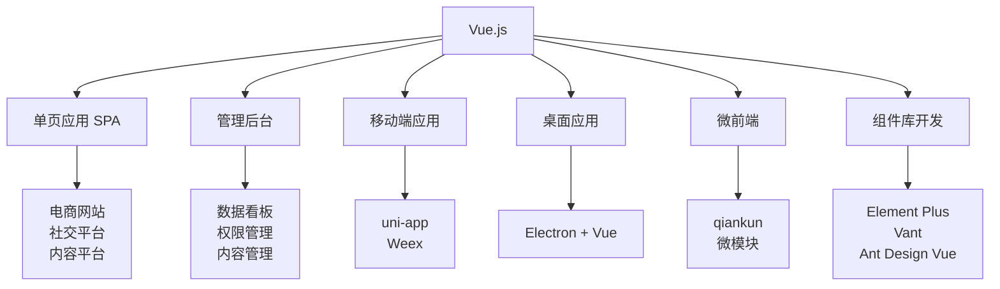

## 一、Vue.js 是什么

### 1.1 一句话概括

**Vue.js 是一个用于构建用户界面的渐进式 JavaScript 框架**，它采用自底向上的增量开发设计，核心库只关注视图层，易于上手且便于与第三方库整合。

### 1.2 Vue.js 的核心特点

| 特点 | 说明 |
|------|------|
| **渐进式** | 可以自底向上逐层应用，从简单到复杂 |
| **响应式** | 数据驱动视图，自动更新 |
| **组件化** | 拆分UI为独立可复用的组件 |
| **轻量级** | 核心库仅20KB左右（gzip后） |
| **双向绑定** | 数据与视图同步更新 |
| **虚拟DOM** | 高效的DOM更新机制 |

### 1.3 Vue.js 能做什么



### 1.4 Vue 2 vs Vue 3 对比

| 对比项 | Vue 2 | Vue 3 |
|--------|-------|-------|
| 性能 | 较好 | 更好（虚拟DOM重写） |
| API 风格 | Options API | Composition API + Options API |
| TypeScript | 支持不完善 | 原生支持 |
| 组合式函数 | 无 | Composables |
| 响应式系统 | Object.defineProperty | Proxy |
| Fragment | 不支持 | 支持多根节点 |
| Teleport | 无 | 内置组件 |
| Suspense | 无 | 内置组件 |
| 生命周期 | beforeCreate/created等 | setup/onMounted等 |

## 二、知识体系路线图

### 2.1 学习路径总览

```
阶段一：基础入门           阶段二：核心技能           阶段三：进阶应用
┌─────────────┐         ┌─────────────┐         ┌─────────────┐
│ 01 基础入门  │  ───▶   │ 03 路由管理  │  ───▶   │ 05 组件进阶  │
│  模板语法    │         │ Vue Router  │         │ 自定义指令   │
│  响应式数据  │         ├─────────────┤         │ 插槽/动态组件│
├─────────────┤         │ 04 状态管理  │         ├─────────────┤
│ 02 组件化    │  ───▶   │   Pinia     │  ───▶   │ 06 网络请求  │
│ Props/Event │         └─────────────┘         │   Axios     │
│  生命周期    │                                  └─────────────┘
└─────────────┘

         阶段四：现代开发              阶段五：项目实战
┌─────────────────────────┐    ┌──────────────────────────────┐
│ 07 Composition API      │    │ 08 项目实战                   │
│   ref/reactive          │    │  ├── Todo List               │
│   生命周期钩子           │    │  ├── 用户管理系统             │
│   组合式函数             │    │  └── 电商后台                 │
└─────────────────────────┘    ├──────────────────────────────┤
                               │ 09 项目实战进阶               │
                               │  ├── 实时聊天应用             │
                               │  ├── 数据可视化大屏           │
                               │  └── 低代码表单引擎           │
                               └──────────────────────────────┘
```

### 2.2 章节详情

| 序号 | 章节名称 | 核心知识点 | 学习目标 |
|------|---------|-----------|---------|
| 01 | Vue.js基础入门 | 创建应用、模板语法、响应式数据、指令、事件处理 | 掌握Vue基础语法和核心概念 |
| 02 | 组件化开发 | 组件定义、Props、自定义事件、插槽、生命周期 | 理解组件思想，构建可复用组件 |
| 03 | Vue Router路由 | 路由配置、嵌套路由、动态路由、导航守卫 | 实现单页应用路由管理 |
| 04 | 状态管理Pinia | Store定义、State、Getters、Actions、持久化 | 管理复杂应用状态 |
| 05 | 组件进阶 | 自定义指令、Teleport、Suspense、异步组件 | 掌握高级组件技巧 |
| 06 | 网络请求Axios | 请求配置、拦截器、错误处理、Token刷新 | 实现前后端数据交互 |
| 07 | Composition API | ref/reactive、生命周期、组合式函数、最佳实践 | 掌握Vue 3核心编程范式 |
| 08 | 项目实战案例 | Todo List、用户管理、电商后台 | 综合运用所学知识 |
| 09 | 项目实战进阶 | 实时聊天、数据大屏、低代码引擎 | 掌握复杂业务场景开发 |

## 三、学习建议

### 3.1 适合人群

- **前端开发者**：希望掌握现代前端框架
- **全栈开发者**：需要构建完整的前后端应用
- **编程初学者**：具备HTML/CSS/JavaScript基础
- **Vue 2 开发者**：希望升级到 Vue 3

### 3.2 学习前置条件

| 技能 | 重要程度 | 说明 |
|------|---------|------|
| HTML/CSS | 必需 | 熟悉常用标签和样式 |
| JavaScript | 必需 | 掌握ES6+语法、异步编程 |
| Node.js | 推荐 | 了解npm包管理 |
| Git | 推荐 | 代码版本管理 |
| TypeScript | 可选 | Vue 3原生支持，后续学习 |

### 3.3 学习方法

1. **动手实践**：每个知识点都要编写代码验证
2. **阅读源码**：学习优秀组件库的实现
3. **构建项目**：从Todo List到完整管理系统
4. **性能优化**：学习Vue性能调优技巧
5. **社区参与**：关注Vue官方动态和RFC

### 3.4 开发工具推荐

| 工具 | 用途 | 推荐 |
|------|------|------|
| 编辑器 | 代码编写 | VS Code + Volar 插件 |
| 项目脚手架 | 快速创建项目 | Vite / Vue CLI |
| 调试工具 | 状态调试 | Vue DevTools |
| API测试 | 接口测试 | Postman / Apifox |
| 组件库 | UI组件 | Element Plus / Ant Design Vue |
| 状态管理 | 全局状态 | Pinia |

## 四、快速开始

### 4.1 创建第一个 Vue 应用

```bash
# 使用 Vite 创建项目（推荐）
npm create vue@latest my-vue-app

# 进入项目目录
cd my-vue-app

# 安装依赖
npm install

# 启动开发服务器
npm run dev
```

### 4.2 项目结构

```
my-vue-app/
├── public/              # 静态资源
├── src/
│   ├── assets/          # 资源文件
│   ├── components/      # 组件目录
│   ├── views/           # 页面组件
│   ├── router/          # 路由配置
│   ├── stores/          # 状态管理
│   ├── App.vue          # 根组件
│   └── main.js          # 入口文件
├── index.html           # HTML模板
├── package.json         # 项目配置
└── vite.config.js       # Vite配置
```

### 4.3 第一个组件

```vue
<!-- src/App.vue -->
<template>
  <div id="app">
    <h1>{{ message }}</h1>
    <button @click="count++">点击次数: {{ count }}</button>
  </div>
</template>

<script setup>
import { ref } from 'vue'

const message = ref('Hello, Vue 3!')
const count = ref(0)
</script>

<style scoped>
#app {
  font-family: Arial, sans-serif;
  text-align: center;
  padding: 20px;
}
</style>
```

### 4.4 运行效果

访问 `http://localhost:5173`，你会看到：
- 标题显示 "Hello, Vue 3!"
- 按钮显示点击次数，每次点击数字增加

## 五、Vue 3 新特性速览

### 5.1 Composition API

```vue
<script setup>
import { ref, computed, onMounted } from 'vue'

// 响应式数据
const count = ref(0)

// 计算属性
const doubled = computed(() => count.value * 2)

// 方法
function increment() {
  count.value++
}

// 生命周期
onMounted(() => {
  console.log('组件已挂载')
})
</script>
```

### 5.2 更好的 TypeScript 支持

```typescript
// 定义 Props 类型
interface Props {
  title: string
  count?: number
}

const props = defineProps<Props>()

// 定义 Emits 类型
interface Emits {
  (e: 'update', value: number): void
}

const emit = defineEmits<Emits>()
```

### 5.3 Fragment 多根节点

```vue
<template>
  <!-- Vue 3 允许多个根节点 -->
  <header>头部</header>
  <main>内容</main>
  <footer>底部</footer>
</template>
```

### 5.4 Teleport 传送门

```vue
<template>
  <Teleport to="body">
    <div class="modal">
      模态框内容
    </div>
  </Teleport>
</template>
```

## 六、常见问题

### Q1：Vue 2 和 Vue 3 该学哪个？

**推荐学习 Vue 3**。原因：
- Vue 3 性能更好，API更现代
- Vue 2 已停止维护（2023年底）
- 新项目都使用 Vue 3
- Composition API 更灵活

### Q2：需要学习 React 吗？

两者都是优秀的前端框架：
- **Vue**：上手简单，模板语法直观
- **React**：生态更大，社区更活跃

建议先精通一个，再学习另一个。

### Q3：需要学习 TypeScript 吗？

**强烈推荐**。Vue 3 原生支持 TypeScript：
- 更好的类型检查
- 更好的IDE支持
- 大型项目必备
- 面试加分项

---

> 💡 **阅读指南**：建议按章节顺序学习，每章都有案例练习。遇到问题时，查阅 [Vue 官方文档](https://cn.vuejs.org/)。