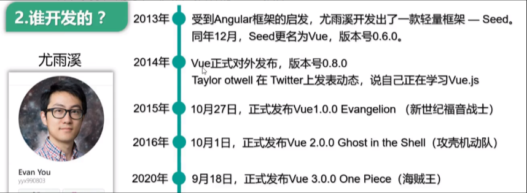

## Vue-基础系列(一)

### 基本认识

Vue (读音 &#x2F;vjuː&#x2F;，类似于 view) 是一套用于**构建用户界面的渐进式框架**。与其它大型框架不同的是，Vue 被设计为可以**自底向上逐层应用**。Vue 的核心库只关注**视图层**，不仅易于上手，还便于与第三方库或既有项目整合。另一方面，当与现代化的工具链以及各种支持类库结合使用时，Vue 也完全能够为复杂的单页应用提供驱动。

**渐进式 JavaScript 框架**，用来动态构建用户界面

官网：[https://cn.vuejs.org/](https://cn.vuejs.org/)

### 特点

遵循 MVVM 模式

编码简洁，体积小，运行效率高，适合 移动&#x2F;PC 端开发

它本身只关注 UI，可以轻松引入 vue 插件或其它第三方库开发项目

采用**组件化**模式，提高代码复用率、且让代码更好维护

**声明式**编码，让编码人员无需直接操作DOM，提高开发效率

使用**虚拟DOM**和**Diff算法**，尽量复用DOM节点

### 与其他前端 JS 框架的关联

借鉴 `angular` 的 **模板** 和 **数据绑定** 技术

借鉴 `react` 的 **组件化** 和 **虚拟DOM** 技术

### Vue 常用工具和插件

- vue-cli：vue 脚手架

开发工具

- 用于快速搭建Vue项目的命令行工具，提供项目模板、开发服务器、热加载、脚本打包等功能。

- vue-resource(axios)：ajax 请求

HTTP请求库

- 用于在Vue应用中执行AJAX请求，axios 是Vue项目中更为常用的HTTP库，替代了`vue-resource`。

- vue-router：路由

路由管理

- 管理单页面应用（SPA）的路由，允许在不同的视图之间进行导航，并支持嵌套路由、动态路由、导航守卫等功能

- vuex：状态管理（它是 vue 的插件但是没有用 vue-xxx 的命名规则）

状态管理

- 集中式状态管理库，适用于中大型Vue应用，能够更好地管理应用中的全局状态

- vue-lazyload：图片懒加载

性能优化

- 实现图片的懒加载，优化页面加载性能，特别适合于图片较多的场景

- vue-scroller：页面滑动相关

页面滚动&#x2F;滑动效果

- 用于处理移动端页面滑动效果，常用于实现下拉刷新、上拉加载等功能。

- mint-ui：基于 vue 的 UI 组件库（移动端）

UI 组件库

- 专为移动端设计的UI组件库，提供了丰富的移动端组件，如按钮、弹框、列表等。

- element-ui：基于 vue 的 UI 组件库（PC 端）

UI 组件库

- 为PC端应用设计的UI组件库，提供了丰富的组件和布局工具，适合企业级应用。

### 引入Vue.js

引入Vue.js可以通过多种方式，具体取决于你的项目类型和需求。以下是几种常见的引入方式：

#### 通过CDN引入

如果你正在开发一个简单的项目或原型，你可以通过内容分发网络（CDN）直接引入Vue.js。这种方式不需要安装任何依赖，非常适合小型项目或快速试验。

&lt;!-- 引入开发版本，带有完整的警告和调试模式 --&gt;
&lt;script src=&quot;https://cdn.jsdelivr.net/npm/vue@2/dist/vue.js&quot;&gt;&lt;/script&gt;

&lt;!-- 或者引入生产版本，带有压缩和优化的性能 --&gt;
&lt;script src=&quot;https://cdn.jsdelivr.net/npm/vue@2/dist/vue.min.js&quot;&gt;&lt;/script&gt;

#### 通过npm安装

对于大多数现代Web开发项目，你会使用npm（Node Package Manager）来管理依赖项。你可以通过npm安装Vue.js并在你的项目中使用它。

npm install vue

安装完成后，可以在项目中通过import或require的方式引入Vue.js。

// ES6 模块导入方式
import Vue from &#x27;vue&#x27;;

// CommonJS 导入方式
const Vue = require(&#x27;vue&#x27;);

#### 使用Vue CLI创建项目

Vue CLI是一个用于快速搭建Vue项目的脚手架工具，它会自动为你配置好Vue.js，并提供开发服务器、热模块替换等功能。

npm install -g @vue/cli
vue create my-project
cd my-project
npm run serve

> 

在通过Vue CLI创建的项目中，Vue.js已经被自动引入，你可以直接在.vue文件或其他JavaScript文件中使用它。

#### 通过下载独立版本

你也可以从Vue.js的官网下载独立的构建版本，并手动在项目中引入。

&lt;script src=&quot;/path/to/vue.js&quot;&gt;&lt;/script&gt;

### 创建Vue对象

- 想让Vue工作，就必须创建一个**Vue实例**，且要传入一个**配置对象**；

- root容器里的代码依然**符合html规范**，只不过混入了一些特殊的Vue语法；

- root容器里的代码被称为【**Vue模板**】；

- **Vue实例和容器是一一对应的**；

- 真实开发中只有一个Vue实例，并且会配合着**组件**一起使用；

- `&#123;&#123;xxx&#125;&#125;`中的xxx要写**js表达式**，且xxx可以**自动**读取到data中的所有属性；

- 一旦data中的数据发生改变，那么页面中用到该数据的地方也会**自动更新**；

//创建Vue实例
new Vue(&#123;
	el:&#x27;#root&#x27;, //el用于指定当前Vue实例为哪个容器服务，值通常为css选择器字符串。
	data:&#123; //data中用于存储数据，数据供el所指定的容器去使用，值我们暂时先写成一个对象。
		name:&#x27;super&#x27;,
		address:&#x27;武汉&#x27;
	&#125;
&#125;)

> 

1.`new Vue(&#123;...&#125;)`：这里是创建 Vue 实例的地方，用名为对象的参数来初始化
2.`el: &#39;#root&#39;`：el是实例的挂载点，#root表示它将附加到中id为root的元素上。这意味着 Vue 将管理这个元素及其所有子元素，这些元素可以通过 Vue 的模板语法访问和操作。
3.`data: &#123;...&#125;`：data属性包含了实例要使用的数据。数据对象中有两个属性：name和address。这些属性可以在 Vue 模板中通过大括号`&#123;&#123;&#125;&#125;`插值语法引用。

#### el

指定根element(选择器)

#### data

初始化数据(页面可以访问)

#### 关于el和data的两种写法

> 

el有2种写法

new Vue时候配置el属性。

const v = new Vue(&#123;
	el:&#x27;#root&#x27;, //第一种写法
	data:&#123;
		name:&#x27;YK菌&#x27;
	&#125;
&#125;)

先创建Vue实例，随后再通过vm.$mount(‘#root’)指定el的值。

const v = new Vue(&#123;
	data:&#123;
		name:&#x27;YK菌&#x27;
	&#125;
&#125;)
v.$mount(&#x27;#root&#x27;) //第二种写法 */

> 

data有2种写法

对象式

data:&#123;
	name:&#x27;super&#x27;
&#125; 

函数式

data()&#123;
	console.log(&#x27;@@@&#x27;,this) //此处的this是Vue实例对象
	return&#123;
		name:&#x27;super&#x27;
	&#125;
&#125;

> 

如何选择：目前哪种写法都可以，以后学习到组件时，data必须使用函数式，否则会报错。

> 

一个重要的原则：**由Vue管理的函数，一定不要写箭头函数，一旦写了箭头函数，this就不再是Vue实例了**

### Vue模板语法

Vue.js的模板语法允许你在Vue组件的模板中使用数据绑定和指令来动态地显示和控制DOM。

#### 1. 插值表达式

**文本插值**：使用`&#123;&#123; &#125;&#125;`语法将数据绑定到HTML文本中。

&lt;p&gt;&#123;&#123; message &#125;&#125;&lt;/p&gt;

> 

如果message是’Hello Vue!’，那么上面的代码会渲染为`&lt;p&gt;Hello Vue!&lt;/p&gt;`。

**属性插值**：使用`v-bind`指令将数据绑定到HTML属性中。

&lt;img v-bind:src=&quot;imageUrl&quot; alt=&quot;Vue Logo&quot;&gt;

或使用简写：

&lt;img :src=&quot;imageUrl&quot; alt=&quot;Vue Logo&quot;&gt;

> 

如果imageUrl是’[https://vuejs.org/images/logo.png&#39;，上面的代码会将图片的src属性设置为该URL。](https://vuejs.org/images/logo.png'%EF%BC%8C%E4%B8%8A%E9%9D%A2%E7%9A%84%E4%BB%A3%E7%A0%81%E4%BC%9A%E5%B0%86%E5%9B%BE%E7%89%87%E7%9A%84src%E5%B1%9E%E6%80%A7%E8%AE%BE%E7%BD%AE%E4%B8%BA%E8%AF%A5URL%E3%80%82)

#### 2.指令（Directives）

指令是以`v-`开头的特殊属性，用于在DOM元素上添加行为。

**条件渲染**：v-if, v-else-if, v-else

&lt;p v-if=&quot;isVisible&quot;&gt;This will be visible if isVisible is true.&lt;/p&gt;
&lt;p v-else&gt;This will be visible if isVisible is false.&lt;/p&gt;

**循环渲染**：v-for

&lt;ul&gt;
 &lt;li v-for=&quot;item in items&quot; :key=&quot;item.id&quot;&gt;&#123;&#123; item.text &#125;&#125;&lt;/li&gt;
&lt;/ul&gt;

> 

items是一个数组，v-for指令用于遍历数组并生成相应的列表项。

**事件处理**：v-on

&lt;button v-on:click=&quot;handleClick&quot;&gt;Click me&lt;/button&gt;

或使用简写：

&lt;button @click=&quot;handleClick&quot;&gt;Click me&lt;/button&gt;

> 

当按钮被点击时，handleClick方法会被调用。

### 双向数据绑定

在Vue中，数据绑定可以分为**单向绑定**和**双向绑定**两种方式：

#### 单向绑定(v-bind)

作用：单向绑定将数据源中的值动态地渲染到视图中，实现了数据到视图的更新。

单向绑定的应用场景和元素：

- 数据展示：将**数据源中的值**动态地显示在视图中。

示例：`&#123;&#123; message &#125;&#125;`

- 属性绑定：将数据源中的值动态地应用到HTML元素的**属性**上。

示例：`:src=&quot;imageUrl&quot;`

#### 双向绑定(v-model)

作用：双向绑定不仅实现了数据到视图的更新，还可以将用户的操作反馈到数据源中，实现了视图和数据源之间的双向同步。

双向绑定的应用场景和元素：

- 表单输入：实现用户输入和数据源之间的双向同步。

示例：`&lt;input v-model=&quot;message&quot;&gt;`

- 复选框和单选按钮：选中状态与数据源之间的双向绑定。

示例：`&lt;input type=&quot;checkbox&quot; v-model=&quot;isChecked&quot;&gt;`

- 下拉选择框：选项的选择和数据源之间的双向绑定。

示例：`&lt;select v-model=&quot;selectedOption&quot;&gt;...&lt;/select&gt;`

- 文本区域：文本内容和数据源之间的双向绑定。

示例：`&lt;textarea v-model=&quot;text&quot;&gt;&lt;/textarea&gt;`

> 

双向绑定示例

&lt;div id=&quot;test&quot;&gt; &lt;!--view--&gt;
 &lt;input type=&quot;text&quot; v-model=&quot;msg&quot;&gt;&lt;br&gt;&lt;!--指令--&gt;
 &lt;p&gt;Hello &#123;&#123;msg&#125;&#125;&lt;/p&gt;&lt;!--大括号表达式--&gt;
&lt;/div&gt;

&lt;script src=&quot;../js/vue.js&quot;&gt;&lt;/script&gt;
&lt;script&gt;
 const vm = new Vue(&#123; // 配置对象 options 
 // 配置选项(option)
 el: &#x27;#test&#x27;, // element: 指定用vue来管理页面中的哪个标签区域
 data: &#123; // 数据（model）
 msg: &#x27;World&#x27;
 &#125;
 &#125;)
&lt;/script&gt;

### 理解Vue的MVVM实现

#### MVVM模型

- M：模型(Model) ：data中的数据

- V：视图(View) ：模板代码（不是静态页面）

- VM：视图模型(ViewModel)：Vue实例

> 

data中所有的属性，最后都出现在了vm身上。vm身上所有的属性 及 Vue原型上所有属性，在Vue模板中都可以直接使用。

MVVM 本质上是 `MVC` （Model-View- Controller）的改进版。即模型-视图-视图模型。

**模型**`model`指的是后端传递的数据，**视图**`view`指的是所看到的页面。

视图模型viewModel是 mvvm 模式的核心，它是连接 view 和 model 的桥梁。它有两个方向：

- 将**模型转化成视图**，即将后端传递的数据转化成所看到的页面。实现的方式是：**数据绑定**

- 将**视图转化成模型**，即将所看到的页面转化成后端的数据。实现的方式是：**DOM 事件监听**

这两个方向都实现的，我们称之为**数据的双向绑定**
